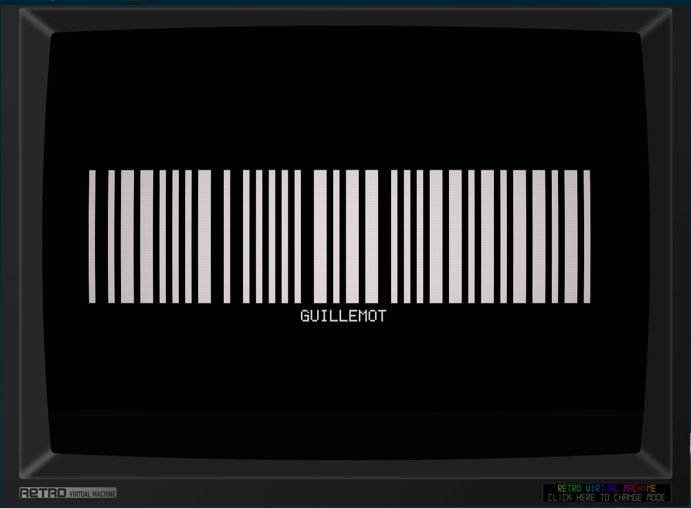

# symsav-birdcode

A barcode screensaver for [SymbOS](https://www.symbos.org/) on the Amstrad CPC.

> **Requires Mode 1** — this screensaver only works in 320×200 Mode 1 (4 colours). Running it in any other screen mode will produce incorrect output.

Inspired by Jamie Zawinski's [barcode](https://www.jwz.org/xscreensaver/) from the xscreensaver suite.

---

## Building

```bash
./build.sh
```

Requires the SCC compiler (set `SCC=` env var if not at `../scc/bin/cc`) and Python 3.

Build steps:

1. SCC compiles `barcode.c` → `barcode.sav`
2. `add_preview.py` patches the preview thumbnail into the binary at file offset 256

Output: `barcode.sav`

---

## Installing

1. Copy `barcode.sav` into your `C:\SYMBOS\` directory.
2. Open **Display Properties** and go to the **Screen Saver** tab.
3. Click **Browse** and select `barcode.sav`.
4. Click **Setup** to configure the effect:
   - **Speed**: Slow / Normal / Fast — how long each barcode is held on screen (~15 s / ~5 s / ~2 s)

---

## Effect

- On each cycle, a bird name is picked at random from a built-in list of 60 species.
- The name is encoded as a **Code 39** barcode and rendered centred on the 320×200 screen.
- The bar ink is chosen randomly each cycle from the three available foreground inks:

| Ink | Appearance |
|-----|------------|
| 0 (white) | white bars |
| 2 (dim) | grey bars |
| 3 (bright) | bright bars |

- The text label below the barcode is always drawn in bright ink (ink 3).
- After the configured pause the screensaver clears the screen and picks the next word.

### Code 39 encoding

- Each character encodes as 9 alternating bar/space elements (5 bars, 4 spaces).
- Elements are either *narrow* (4 px = 1 Mode-1 byte) or *wide* (8 px = 2 Mode-1 bytes).
- The encoded string is wrapped in start/stop `*` guards.
- The barcode is centred horizontally; the longest name (OYSTERCATCHER, 13 chars + 2 guards) fits within the 320 px screen width.

---

## Screensaver protocol

Standard SymbOS screensaver messages:

| Message | Action |
|---------|--------|
| `MSC_SAV_INIT` (1) | Load saved config from manager |
| `MSC_SAV_START` (2) | Start fullscreen animation |
| `MSC_SAV_CONFIG` (3) | Open config dialog |
| `MSR_SAV_CONFIG` (4) | Send updated config back |

Config is 5 bytes: magic `"BRCX"` + speed byte (1–3).

---

## Animation

Fullscreen rendering follows the same approach as [symsav-xmatrix](https://github.com/salvogendut/symsav-xmatrix) and [symsav-mountain](https://github.com/salvogendut/symsav-mountain):

1. Open a fullscreen `WIN_NOTTASKBAR | WIN_NOTMOVEABLE` window
2. `DSK_SRV_DSKSTP` to freeze the desktop
3. Clear all 8 CPC character planes via `Bank_Copy` to VRAM (bank 0, all bytes = `0xF0` = ink 1 = black)
4. Build a pre-encoded 80-byte scanline buffer for the barcode, then write it scanline-by-scanline via `Bank_Copy`
5. Render the text label row by row using a 5×8 pixel font
6. Wait the configured number of idle ticks, then repeat with a new random word
7. Exit on any key or mouse movement: resume desktop, close window, `Screen_Redraw()`

VRAM address formula for pixel row y, byte column x:

```
addr = 0xC000 + (y/8)*80 + (y%8)*0x800 + x
```

Mode-1 pixel encoding within each byte (4 pixels per byte):

```
bit7=p0_lo  bit6=p1_lo  bit5=p2_lo  bit4=p3_lo
bit3=p0_hi  bit2=p1_hi  bit1=p2_hi  bit0=p3_hi
```

Where `lo = bit0(ink)` and `hi = bit1(ink)`.
